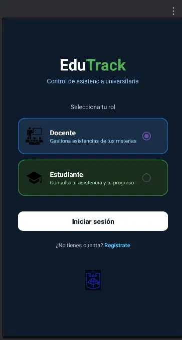
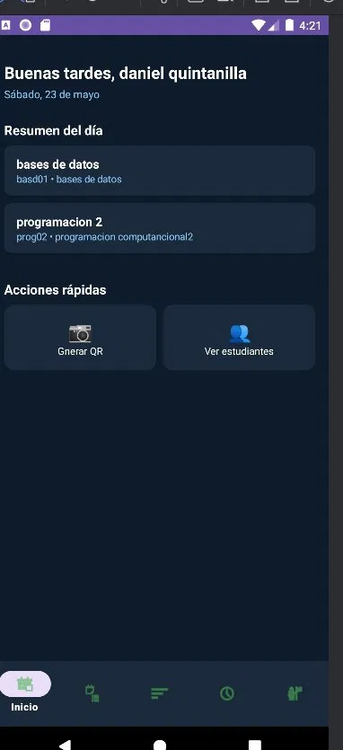
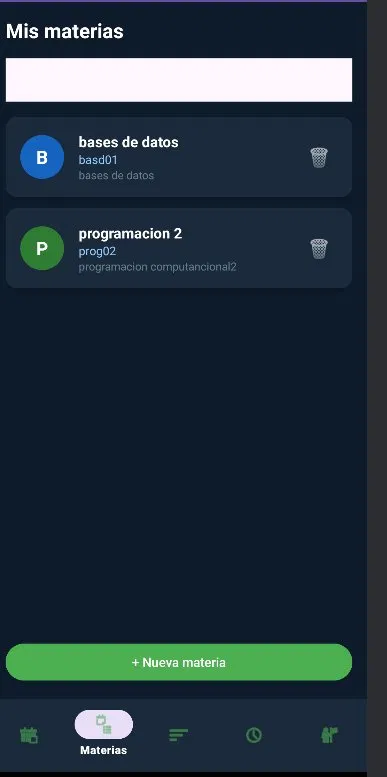
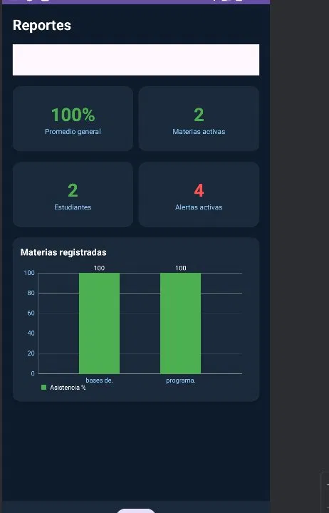
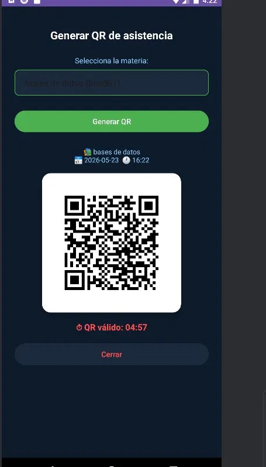
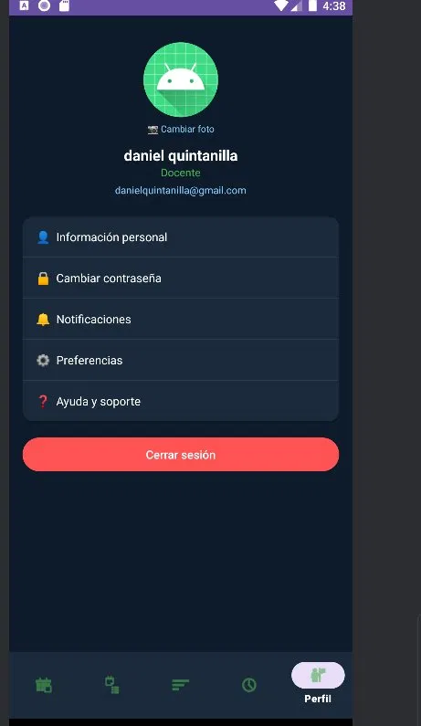
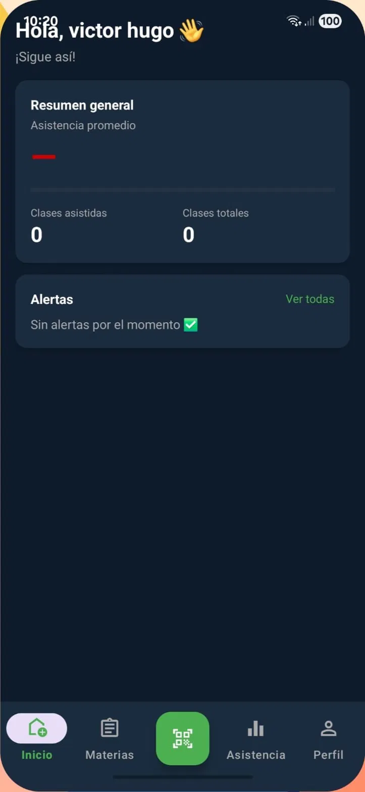
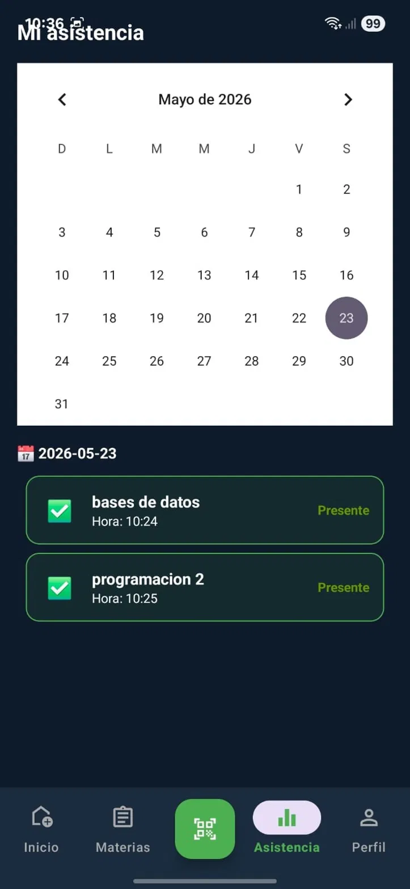
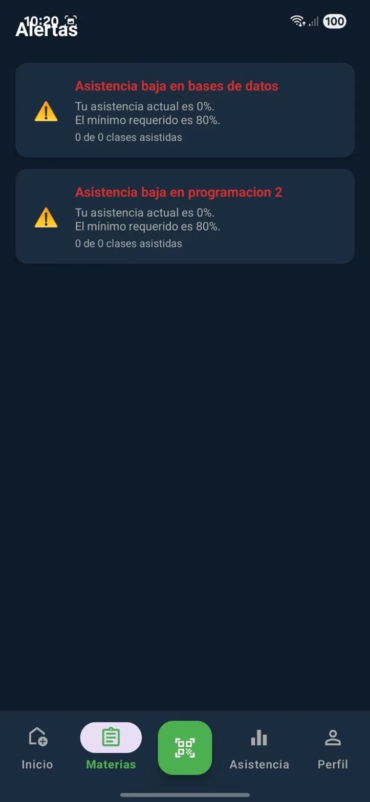

📚 EduTrack — Control de Asistencia Universitaria

Aplicación Android para el control de asistencia mediante códigos QR, desarrollada con Java, SQLite y Firebase.

📋 Descripción
EduTrack es una aplicación móvil Android que permite a docentes y estudiantes gestionar la asistencia universitaria de forma digital. Los docentes generan códigos QR por sesión, y los estudiantes los escanean para registrar su presencia. Toda la información se sincroniza en tiempo real con Firebase Firestore.

✨ Características
👨‍🏫 Rol Docente

Gestión de materias (crear, editar, eliminar)
Generación de QR por sesión con temporizador de 5 minutos
Historial de asistencias con presentes/total por sesión
Reportes visuales con gráfico de barras (MPAndroidChart)
Inscripción de estudiantes a materias
Perfil con foto, información personal y cambio de contraseña

👨‍🎓 Rol Estudiante

Escaneo de QR para registrar asistencia
Calendario de asistencias con tarjetas verde (Presente) y roja (Ausente)
Porcentaje de asistencia por materia
Alertas cuando la asistencia baja del 80%
Perfil con foto, información personal y cambio de contraseña

🔐 Seguridad

Autenticación con Firebase Auth (correo y contraseña)
Fallback a SQLite local sin conexión
Login con huella dactilar (BiometricPrompt)
QR con validación de fecha para evitar reutilización

📸 Screenshots
Pantalla de inicio de sesión

  

Dashboard Docente

  
  &nbsp;&nbsp;
  
  &nbsp;&nbsp;
  

Generación de QR

  
  &nbsp;&nbsp;
  

Dashboard Estudiante

  
  &nbsp;&nbsp;
  
  &nbsp;&nbsp;
  

🛠️ Tecnologías utilizadas
TecnologíaUsoJavaLenguaje principalSQLiteBase de datos localFirebase AuthAutenticación de usuariosFirebase FirestoreSincronización en la nubeZXing (zxing-android-embedded)Generación y escaneo de QRMPAndroidChartGráficos de reportesCircleImageViewFoto de perfil circularAndroidX BiometricLogin con huella dactilar

📦 Dependencias
kotlinimplementation(platform("com.google.firebase:firebase-bom:32.7.0"))
implementation("com.google.firebase:firebase-firestore")
implementation("com.google.firebase:firebase-auth")
implementation("androidx.recyclerview:recyclerview:1.3.2")
implementation("androidx.cardview:cardview:1.0.0")
implementation("com.journeyapps:zxing-android-embedded:4.3.0")
implementation("com.github.PhilJay:MPAndroidChart:v3.1.0")
implementation("de.hdodenhof:circleimageview:3.1.0")
implementation("androidx.biometric:biometric:1.1.0")

🗄️ Estructura de la base de datos
SQLite (local) — DB_VERSION 8
TablaDescripciónsesionSesión activa del usuariousuariosDocentes y estudiantes registradosmateriasMaterias por docenteasistenciaSesiones QR generadas por el docenteinscripcionesEstudiantes inscritos por materiaasistencia_estudianteRegistro individual de asistencia
Firebase Firestore (nube)
ColecciónDescripciónusuariosDatos de usuario sincronizadosmateriasMaterias sincronizadas entre dispositivosasistenciaSesiones con conteo de presentes/totalasistencia_estudianteRegistros individuales de escaneoinscripcionesInscripciones identificadas por correo

🚀 Instalación
Requisitos

Android Studio Hedgehog o superior
Android SDK 26+
Cuenta de Firebase con proyecto configurado

Pasos

Clona el repositorio:

bashgit clone https://github.com/tu-usuario/edutrack-android.git

Abre el proyecto en Android Studio.
Agrega tu archivo google-services.json en la carpeta app/:

edutrack-android/
  app/
    google-services.json  ← aquí

Configura Firebase:

Activa Authentication con correo y contraseña
Activa Firestore Database

Sincroniza Gradle y ejecuta la app.

📱 Uso
Como Docente

Regístrate o inicia sesión seleccionando el rol Docente
Crea tus materias en la pestaña Materias
Inscribe estudiantes a tus materias
Genera un QR desde el botón Generar QR — válido por 5 minutos
Consulta el historial y reportes de asistencia

Como Estudiante

Regístrate o inicia sesión seleccionando el rol Estudiante
El docente debe inscribirte a las materias
Escanea el QR del docente para registrar tu asistencia
Consulta tu calendario de asistencias y alertas

🔐 Login con huella dactilar
Después de iniciar sesión por primera vez, la app guarda la sesión. Al volver a abrir la aplicación, si el dispositivo tiene una huella registrada en el sistema, se mostrará automáticamente el prompt de autenticación biométrica.

👨‍💻 Desarrollado por
Daniel Quintanilla
Estudiante de Ingeniería en Sistemas — Universidad Gerardo Barrios (UGB)
El Salvador, 2026

📄 Licencia
mit
