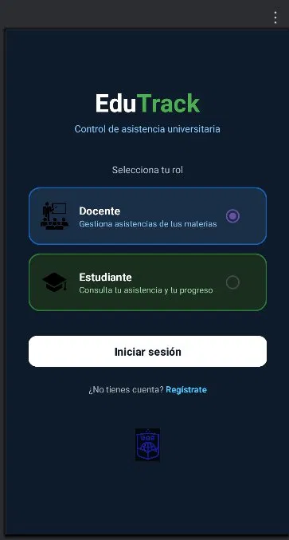
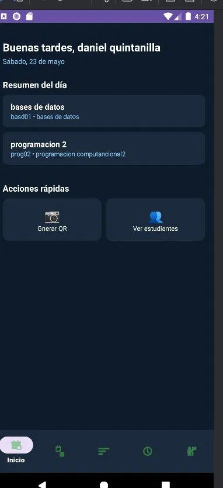
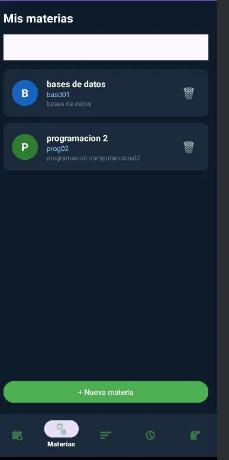
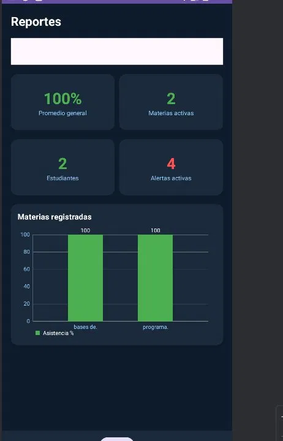
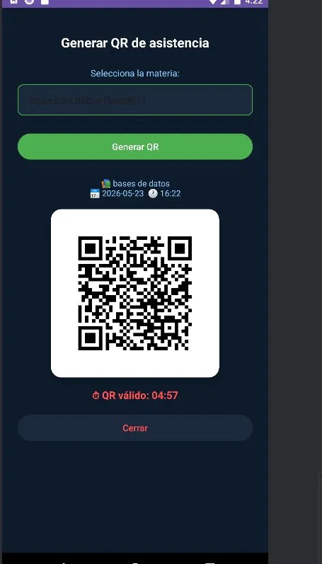
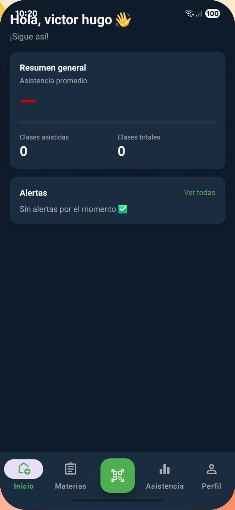
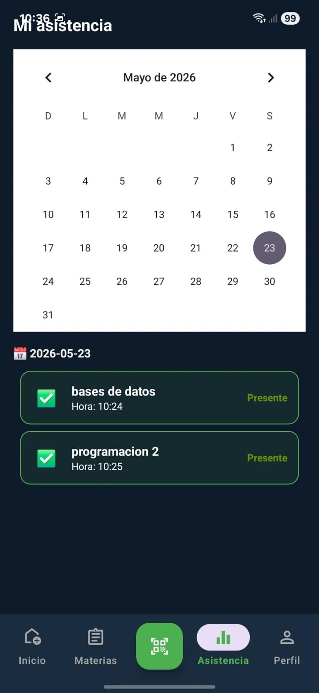
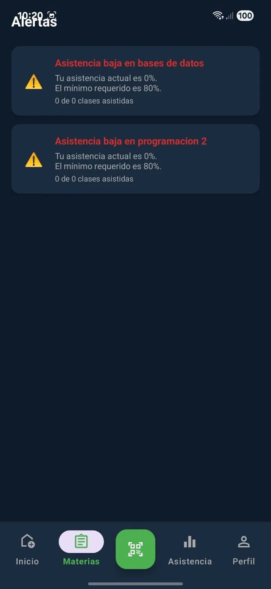
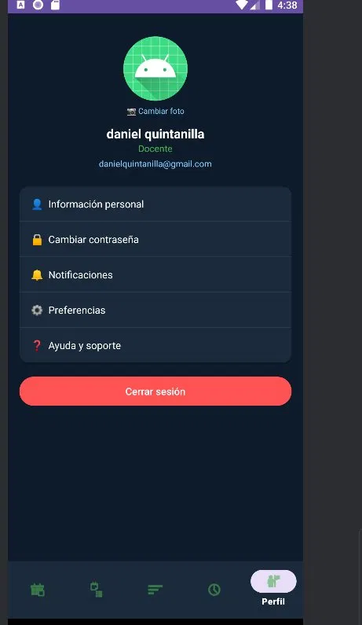

<p align="center">

</p>

<p align="center">
  
  
  
  
  
</p>

<p align="center">
  <b>Aplicación Android para gestión de asistencia universitaria mediante códigos QR</b><br/>
  Desarrollada con Java · SQLite · Firebase · ZXing · Biometría
</p>

---

## 📋 Descripción

**EduTrack** es una aplicación móvil Android diseñada para digitalizar el control de asistencia en entornos universitarios. Los **docentes** generan códigos QR por sesión con un temporizador de validez, y los **estudiantes** los escanean para registrar su presencia automáticamente. Todo se sincroniza en tiempo real con Firebase Firestore, con fallback a SQLite local sin conexión.

---

## 📸 Screenshots

<p align="center">
  
</p>

**Dashboard Docente**

<p align="center">
  
  &nbsp;
  
  &nbsp;
  
  &nbsp;
  
</p>

**Dashboard Estudiante**

<p align="center">
  
  &nbsp;
  
  &nbsp;
  
  &nbsp;
  
</p>

---

## ✨ Características

<table>
<tr>
<td width="50%">

### 👨‍🏫 Rol Docente

- 📚 Gestión de materias (crear, editar, eliminar)
- 📷 Generación de QR por sesión con temporizador de **5 minutos**
- 📊 Historial de asistencias con conteo presentes/total
- 📈 Reportes visuales con gráfico de barras (MPAndroidChart)
- 👥 Inscripción de estudiantes a materias
- 🖼️ Perfil con foto, info personal y cambio de contraseña

</td>
<td width="50%">

### 👨‍🎓 Rol Estudiante

- 📷 Escaneo de QR para registrar asistencia
- 📅 Calendario con tarjetas **verde** (Presente) / **roja** (Ausente)
- 📊 Porcentaje de asistencia por materia
- ⚠️ Alertas cuando la asistencia baja del **80%**
- 🖼️ Perfil con foto, info personal y cambio de contraseña

</td>
</tr>
</table>

### 🔐 Seguridad

| Feature | Implementación |
|---|---|
| Autenticación | Firebase Auth (correo + contraseña) |
| Offline | Fallback automático a SQLite local |
| Biometría | Login con huella dactilar (BiometricPrompt) |
| QR seguro | Validación de fecha para evitar reutilización |

---

## 🛠️ Tech Stack

<p align="center">


</p>

| Tecnología | Uso |
|---|---|
| **Java** | Lenguaje principal |
| **SQLite** (DB_VERSION 8) | Base de datos local offline |
| **Firebase Auth** | Autenticación de usuarios |
| **Firebase Firestore** | Sincronización en la nube |
| **ZXing** (zxing-android-embedded) | Generación y escaneo de QR |
| **MPAndroidChart** | Gráficos de reportes |
| **CircleImageView** | Foto de perfil circular |
| **AndroidX Biometric** | Login con huella dactilar |

---

## 🗄️ Base de datos

### SQLite (local — offline)

| Tabla | Descripción |
|---|---|
| `sesion` | Sesión activa del usuario |
| `usuarios` | Docentes y estudiantes registrados |
| `materias` | Materias por docente |
| `asistencia` | Sesiones QR generadas por el docente |
| `inscripciones` | Estudiantes inscritos por materia |
| `asistencia_estudiante` | Registro individual de asistencia |

### Firebase Firestore (nube — tiempo real)

| Colección | Descripción |
|---|---|
| `usuarios` | Datos de usuario sincronizados |
| `materias` | Materias sincronizadas entre dispositivos |
| `asistencia` | Sesiones con conteo de presentes/total |
| `asistencia_estudiante` | Registros individuales de escaneo |
| `inscripciones` | Inscripciones identificadas por correo |

---

## 📦 Dependencias

```kotlin
implementation(platform("com.google.firebase:firebase-bom:32.7.0"))
implementation("com.google.firebase:firebase-firestore")
implementation("com.google.firebase:firebase-auth")
implementation("androidx.recyclerview:recyclerview:1.3.2")
implementation("androidx.cardview:cardview:1.0.0")
implementation("com.journeyapps:zxing-android-embedded:4.3.0")
implementation("com.github.PhilJay:MPAndroidChart:v3.1.0")
implementation("de.hdodenhof:circleimageview:3.1.0")
implementation("androidx.biometric:biometric:1.1.0")
```

---

## 🚀 Instalación

**Requisitos:**
- Android Studio Hedgehog o superior
- Android SDK 26+
- Cuenta de Firebase con proyecto configurado

**Pasos:**

```bash
# 1. Clonar el repositorio
git clone https://github.com/DanielQuintanillaPaniagua/edutrack-android.git

# 2. Abrir en Android Studio
```

```
# 3. Agregar google-services.json en app/
edutrack-android/
  app/
    google-services.json  ← aquí
```

```
# 4. Configurar Firebase Console
  ✅ Activar Authentication → Correo y contraseña
  ✅ Activar Firestore Database

# 5. Sync Gradle → Run
```

---

## 📱 Uso rápido

**Como Docente:**
1. Registrate seleccionando rol **Docente**
2. Creá tus materias en la pestaña Materias
3. Inscribí estudiantes a tus materias
4. Generá un QR desde **Generar QR** — válido por 5 minutos
5. Consultá el historial y reportes de asistencia

**Como Estudiante:**
1. Registrate seleccionando rol **Estudiante**
2. El docente te inscribe a las materias
3. Escaneá el QR para registrar tu asistencia
4. Consultá tu calendario de asistencias y alertas de bajo rendimiento

> **💡 Biometría:** Después del primer login la app guarda la sesión. Al volver a abrir, si el dispositivo tiene huella registrada, se activa automáticamente el prompt biométrico.

---

## 👨‍💻 Equipo de desarrollo

<table>
<tr>
<td align="center"><b>Daniel Quintanilla</b></td>
<td align="center"><b>David Rivas</b></td>
<td align="center"><b>Abigail Vásquez</b></td>
<td align="center"><b>Jenifer Renderos</b></td>
<td align="center"><b>Arely Sorto</b></td>
</tr>
</table>

> Estudiantes de Ingeniería en Sistemas — **Universidad Gerardo Barrios (UGB)**
> El Salvador, 2026 🇸🇻

---

## 📄 Licencia

MIT License — libre de usar, modificar y distribuir con atribución.

---

<p align="center">

</p>
